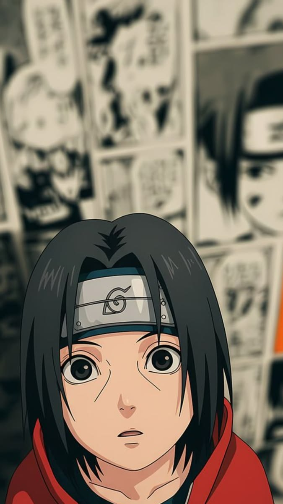

  

- 💼 BSc CS Student @ Unity University
- ⚡ Solo Dev • Startup Founder (Founder of something. Ask again in 6 months.)
- 💻 Tech Stack: PHP, MySQL, Java, Spring Boot, JavaScript, React, Flutter, Dart, Node.js
- 🔧 Tools: GitHub, Vercel, MariaDB, SQLite
- 🎨 Design: Adobe Illustrator, Photoshop, Figma
- 📖 Learning: Supabase, Docker, PostgreSQL
- 🎮 Hobbies: Coding, breaking things, fixing things I broke, avoiding humans
- 🐾 Loves: Coffee, anime, side projects, silence, code that compiles first try (never happens)
- 😎 Status: 404 Social life not found
- 🚪 Social Battery: permanently at 0%
- 🚪 IRL Friends: still compiling
- 🚪 Goes outside: only for wifi outages
- 🚪 People: prefer them in anime form

  

   
    

